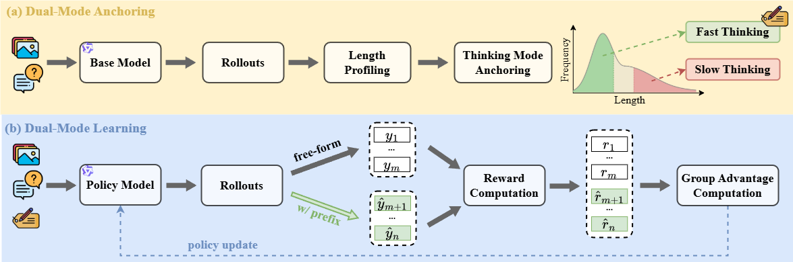

<div align="center">

<h1> Learning to Think Fast and Slow for Visual Language Models </h1>

<h5 align="center"> 

<a href='https://arxiv.org/pdf/2511.16670'>
  
</a>

<a href='https://huggingface.co/maifoundations/DualMindVLM'>
  
</a>

<a href='https://www.maifoundations.com/blog/dualmindvlm/'>
  
</a>

</h5>
</div>

## 💡 Overview

We introduce **DualMindVLM**, a dual-mode thinking VLM that leverages the model's intrinsic prior on response length to develop two controllable thinking modes, enabling **automatic switching between fast and slow thinking**. DualMindVLM is optimized using a simple RL approach built only on question–answer pairs. The approach consists of two stages: In the first stage, each training instance is anchored to a thinking prefix following the model's natural response length tendency. In the second stage, we employ GRPO with partially-constrained rollouts where half of the trajectories are generated with a thinking mode prefix while the other half are freely generated. Despite its simplicity, DualMindVLM significantly outperforms the base model and achieves performance on par with state-of-the-art visual reasoning models, while maintaining high token efficiency.

<p align="center">
  
</p>

---

## 🚀 Release Progress

| Component | Status | Notes |
|-----------|--------|-------|
| 🧩 **Model** | ✔️ Released | Available on 🤗 HuggingFace |
| ⚙️ **Inference + Evaluation Code** | ✔️ Released | vLLM-based inference, string-matching evaluation |
| 🔥 **Training Code** | 🕒 Coming Soon | GRPO-based training framework |

---

## 🔗 Citation

If you find this work useful, please cite our paper:

```bibtex
@article{lin2025dualmindvlm,
  title     = {Learning to Think Fast and Slow for Visual Language Models},
  author    = {Chenyu Lin and Cheng Chi and Jinlin Wu and Sharon Li and Kaiyang Zhou},
  journal   = {arXiv preprint arXiv:2511.16670},
  year      = {2025}
}
